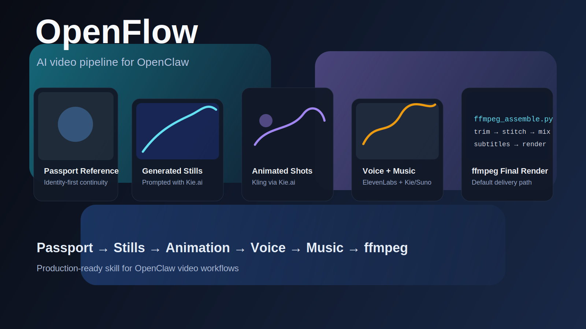
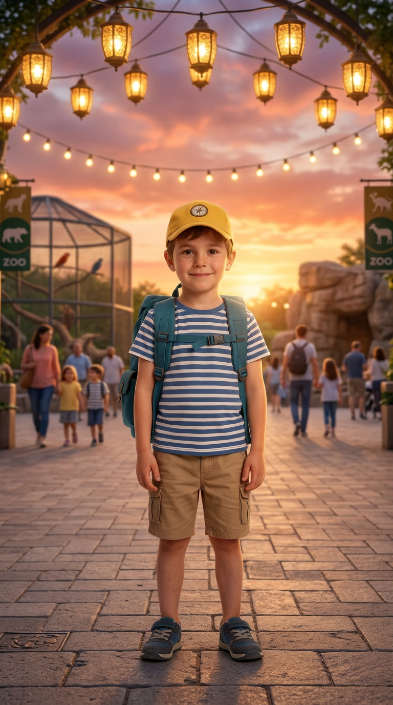

# OpenFlow




**OpenFlow** is an OpenClaw skill for turning a rough creative idea into a fully produced short-form AI video.

It is built for real end-to-end production workflows where one agent coordinates:
- story and shot planning
- prompt polishing
- passport/reference image setup
- image generation with Kie.ai
- image-to-video animation with Kling via Kie.ai
- voice design and narration with ElevenLabs
- music generation with Kie/Suno when needed
- ffmpeg-first editing, trimming, subtitle burn-in, and final render

## At a glance

- **Default editor/renderer:** ffmpeg
- **Image generation:** Kie.ai / nano-banana-2
- **Animation:** Kling via Kie.ai
- **Voice:** ElevenLabs + Voice Design
- **Music:** Kie/Suno or other configured paths when explicitly allowed
- **Consistency system:** passport/reference-first workflow
- **Quality control:** requirements guard, edit-direction, preflight, and delivery audit

## Why OpenFlow exists

OpenFlow is not just a prompt template.
It is a production workflow for taking a loose request like:
- "make me a 30-second ad"
- "build a short story with one recurring character"
- "animate scene stills, narrate them, and export a final MP4"

…and turning that request into a structured pipeline with guardrails.

## What makes it strong

### 1. Continuity first
If a recurring character or product matters, OpenFlow creates a clean passport-style reference image first, then reuses it to anchor later shots.

### 2. Editing judgment, not just asset dumping
Generated 5-second clips are treated as **source material**, not automatically final timeline lengths.
Energetic edits usually keep only the strongest **~3 seconds** of each shot.

### 3. Narration must match the shot
If the voiceover mentions a concrete thing or event, the concurrent visual should show that thing, its consequence, or an obvious supporting visual.

### 4. Proof-gated workflow
OpenFlow supports hard-gated artifacts before delivery:
- `delivery-checklist.md`
- `edit-plan.md`
- `preflight-report.md`
- `delivery-audit.md`

### 5. ffmpeg-first final assembly
Editing/rendering now defaults to **ffmpeg-based assembly**, not Remotion-first assembly.
Remotion can still be used intentionally, but it is no longer the default path.

## Core pipeline

1. **Spark ideation**
   - optionally use `creative-seeds` to break stale thinking before scene design
2. **Plan the video**
   - define goal, duration, aspect ratio, tone, and shot structure
3. **Create a passport/reference image**
   - if a recurring character/product needs continuity
4. **Generate scene stills**
   - polished prompts + Kie image generation
5. **Animate scenes**
   - Kling image-to-video clips
6. **Design voice + render narration**
   - ElevenLabs Voice Design when appropriate
7. **Generate or attach music**
   - Kie/Suno by default when custom soundtrack generation is needed
8. **Assemble with ffmpeg**
   - trims, sequencing, voice/music mix, subtitles, final export
9. **Preflight and audit**
   - check pacing, wiring, narration/visual alignment, and delivery readiness

## Real generated outputs

These are real outputs produced through the workflow on the server:

- **KorKola 30s ad** — <https://drive.google.com/file/d/1_aHbK6EQDTOATJNaLgTkHckfFh_9Gizt/view?usp=drivesdk>
- **Abigail rebuild with Hebrew subtitles** — <https://drive.google.com/file/d/144SokuiAwAq0nIkrUlhFimhBTeoH03dN/view?usp=drivesdk>
- **Red Bull-inspired F1 ad v1** — <https://drive.google.com/file/d/1OfepqfM2YgU4grhxEszvA8YT5JIRed_0/view?usp=drivesdk>
- **Red Bull-inspired F1 ad v2** — <https://drive.google.com/file/d/171oiPDP52upOWbi9PE8PA5oDNLa01snj/view?usp=drivesdk>
- **Red Bull-inspired F1 ad v3** — <https://drive.google.com/file/d/1BKlanQvf7eDfBqT-Y0DWhv58J3d65rXZ/view?usp=drivesdk>
- **Swarovski-inspired jewelry ad** — <https://drive.google.com/file/d/1q2_sA1UbsfUb6HlnG57PqVaNV8tMkIn3/view?usp=drivesdk>

## Example outputs

These examples show the kinds of intermediate assets OpenFlow produces during a real workflow — not just a single final render.

### Character passport reference


### Example generated scenes
<p align="center">
  
  
  
</p>

## Companion skills

This repo ships with companion quality-control skills meant to be used alongside OpenFlow:

- `video-editing-director` — editing judgment for cuts, pacing, trim points, and scene order
- `openflow-requirements-guard` — requirement checklist / gatekeeper for user-mandated workflow steps
- `remotion-preflight-review` — timeline preflight for ffmpeg-first or intentionally-Remotion workflows
- `video-delivery-auditor` — evidence-based QA before claiming completion

Packaged `.skill` files for these companions are included under `dist/`.

## Use cases

OpenFlow works especially well for:
- short-form ads
- jewelry and product commercials
- cinematic teasers
- talking-head or narrated promos
- character-consistent story videos
- before/after transformations
- multilingual social edits with subtitles

## Quickstart

1. Install the skill in an OpenClaw workspace.
2. Provide API credentials outside the repo.
3. Ask for a video with a clear goal, duration, and aspect ratio.
4. Let OpenFlow plan, generate, animate, voice, score, trim, and render.
5. Review the proof artifacts before delivery.

## Repository structure

```text
OpenFlow/
├── SKILL.md
├── README.md
├── dist/
│   ├── kie-video-studio.skill
│   ├── video-editing-director.skill
│   ├── video-delivery-auditor.skill
│   ├── remotion-preflight-review.skill
│   └── openflow-requirements-guard.skill
├── assets/
│   └── screenshots/
├── references/
│   ├── kling-kie.md
│   ├── music-generation.md
│   ├── narration-visual-alignment.md
│   ├── prompt-patterns.md
│   ├── shot-length-and-trimming.md
│   └── workflow.md
└── scripts/
    ├── elevenlabs_tts.py
    ├── ffmpeg_assemble.py
    ├── ffmpeg_preflight.py
    └── kie_job_client.py
```

## Important files

### `SKILL.md`
The main OpenClaw skill definition.
It explains when to use the skill and how the workflow should behave.

### `references/workflow.md`
High-level flow for intake, planning, asset creation, animation, voice, music, ffmpeg assembly, and revision loops.

### `references/narration-visual-alignment.md`
Rules for making the shot on screen match the narration line being spoken.

### `references/shot-length-and-trimming.md`
Rules for generating slightly longer source shots but using tighter, stronger selections in the final cut.

### `scripts/kie_job_client.py`
Generic Kie.ai helper for creating and polling jobs.

### `scripts/elevenlabs_tts.py`
Minimal ElevenLabs helper for narration generation.

### `scripts/ffmpeg_preflight.py`
Validates timeline segments, trims, narration/music presence, and render readiness.

### `scripts/ffmpeg_assemble.py`
Builds trimmed subclips, stitches them, mixes narration/music, optionally burns subtitles, and renders the final MP4 with ffmpeg.

## Confirmed working pieces

This repo was built from real end-to-end testing in an OpenClaw workspace.
Verified in practice:

- Kie.ai image generation workflow
- Kling via Kie.ai using `kling-3.0/video`
- ElevenLabs voice generation
- ElevenLabs Voice Design workflow compatibility
- ffmpeg-first assembly and rendering
- final vertical MP4 export from a multi-stage generated workflow

## Expected environment

OpenFlow assumes an environment with:
- Python 3
- Node.js and npm
- an OpenClaw workspace
- network access for the required APIs
- credentials available outside version control

Typical external services used by the workflow:
- **Kie.ai** for image generation and Kling animation
- **ElevenLabs** for voice design and narration
- **ffmpeg** for assembly and render by default

## Credentials and safety

No API keys are included in this repository.

The helper scripts are written to load credentials from environment variables or local credential files that live **outside** the repo.

This repo is intentionally safe to publish because it does **not** include:
- API keys
- secrets
- credential files
- private user assets
- generated output folders from real jobs

## What this repo is for

This repository is best viewed as:
- a reusable OpenClaw skill
- a reference implementation for AI-assisted video workflows
- a base for building stronger creative automations over time

It is not meant to be a full commercial SaaS or standalone GUI app.
It is the workflow layer that teaches an agent how to orchestrate the moving parts.

## FAQ

### Does OpenFlow create a passport image first?
Yes — when continuity matters for a recurring character or product, it creates a passport/reference image first and uses it as the anchor for later shots.

### Does OpenFlow just drop raw 5-second clips into the timeline?
No. The workflow now biases toward generating slightly longer source clips and then keeping only the strongest ~3 seconds in the final edit for energetic work.

### Does narration have to match what is on screen?
Yes. The workflow includes explicit narration-to-visual alignment rules, plus preflight/audit checks to reduce mismatches.

### Is ffmpeg really the default now?
Yes. The workflow is ffmpeg-first for final assembly and rendering. Remotion is optional, not the default.

### Can it prove where music came from?
Yes. For proof-gated jobs, it can keep create/status/selection artifacts for generated music and block delivery if a required proof chain is missing.

## Summary

OpenFlow turns a vague video request into a structured pipeline:

**idea → scenes → images → animation → voice → music → ffmpeg assembly → final render**

If you are building agent-driven content workflows inside OpenClaw, this repo is a strong starting point.
